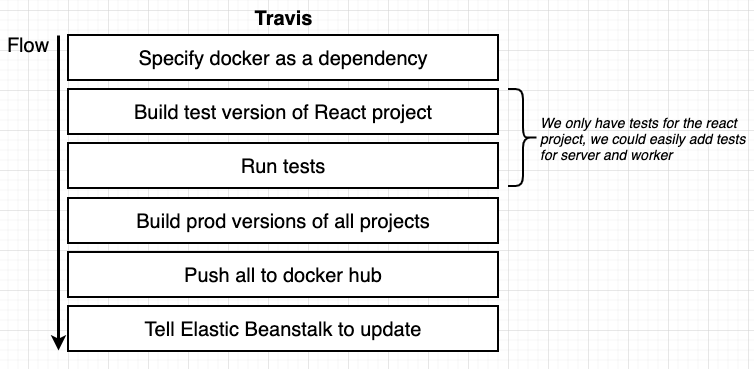

# APP overview


# APP architecture on AWS
  
we will use the built in solution for Redis and Postgres instead of creating docker containers for those elements, it's much easier and secure.  

 

# Analogy between docker-compose and docker.run.aws
for this project we will not use docker compose as AWS Beanstalk doesn't know how to run containers with docker compose instead we will use :  

 

# Workflow definition for multi container App (compared to one single container App)
## for single container app we have :
 

## for multi container app we will use the workflow :


# Travis CI/CD workflow and code:



> the code :

```YAML
sudo: required
language: generic

services:
  - docker

before_install:
  - docker build -t cygnetops/react-test -f ./client/Dockerfile.dev ./client

script:
  - docker run -e CI=true cygnetops/react-test npm test

after_success:
  - docker build -t cygnetops/multi-client-10-14 ./client
  - docker build -t cygnetops/multi-nginx-10-14 ./nginx
  - docker build -t cygnetops/multi-server-10-14 ./server
  - docker build -t cygnetops/multi-worker-10-14 ./worker
  # Log in to the docker CLI
  - echo "$DOCKER_PASSWORD" | docker login -u "$DOCKER_ID" --password-stdin
  # Take those images and push them to docker hub
  - docker push cygnetops/multi-client-10-14
  - docker push cygnetops/multi-nginx-10-14
  - docker push cygnetops/multi-server-10-14
  - docker push cygnetops/multi-worker-10-14

deploy:
  provider: elasticbeanstalk
  region: 'us-east-1'
  app: 'multi-docker'
  env: 'MultiDocker-env'
  bucket_name: 'elasticbeanstalk-us-east-1-923445559289'
  bucket_path: 'docker-multi'
  on:
    branch: master
  access_key_id: $AWS_ACCESS_KEY
  secret_access_key: $AWS_SECRET_KEY
```

# Communication between containers
the communication is assured by putting the containers on the same VPC (virtual Private Cloud), this step is explained in procedure.
  

for more details please check the procedure attached.