# Project Overview

for this project we will use a production grade workflow as described below:  
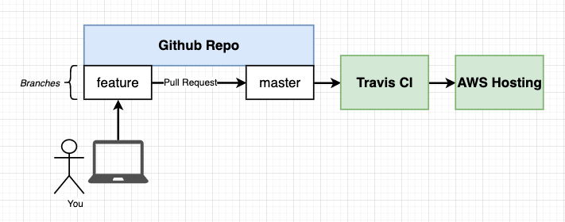
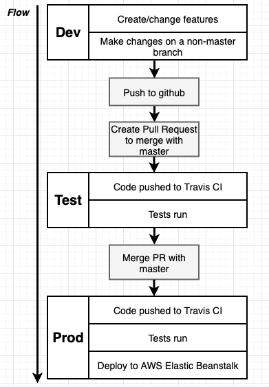

## Aside view about the react app*
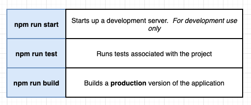

generate the react app bootstrap example, we type the following command:  
**npx create-react-app frontend**

## DOCKERFILE
as we have different environment (development and production), so it's normal to have 2 dockerfiles.
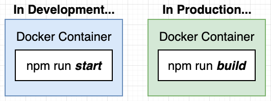
- Dockerfile.dev
- Dockerfile.prod

each dockerfile will be used to create the docker image for (development and production)
## building the dev image
**docker build -f Dockerfile.dev . (-f to specify the file we want to use to build the image)

## Using Docker Volumes
this option is very helpful when we want to update our app images directly without rebuilding the project, the trick is instead of copying the app files inside the container (COPY . .) we will open like a port mapping to permit to the container to get those files from our local directory.  
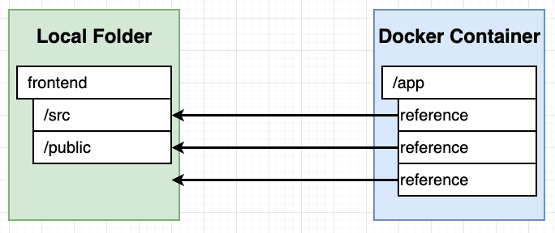
the bookmark is the file that is inside the container that we don't want to be part of the mapping to our local directory  
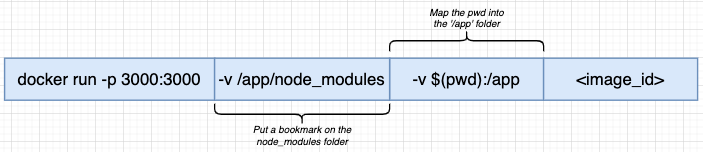

if there is no conflict or you don't want to remove a specific folder/or file mapping you can go with :  
docker run -d -p 3000:3000 -v $(pwd):/app ImageID

$
## Using docker volumes with Docker-compose
to simplify the long running command above, we can use the docker-compose to simplify
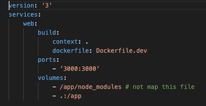

## Running Tests (and updating tests)
to run the tests we can use docker exec -it containerID sh (to get the shell and run the command npm run test)  
or  
to run the tests we can use docker exec -it containerID npm run test  

another solution will be to use docker-compose and build 2 containers with 2 different running CMD  
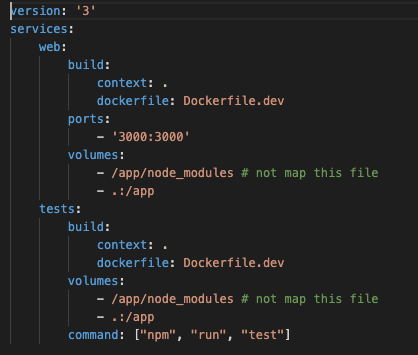

# APP into production envirronment
for production envirronement we will use the command **npm run build**  
so in the development environment we were in the following conf:  
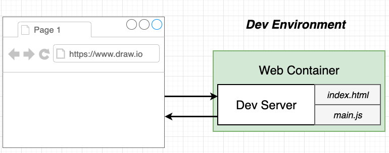  
but when in production we will be using :  
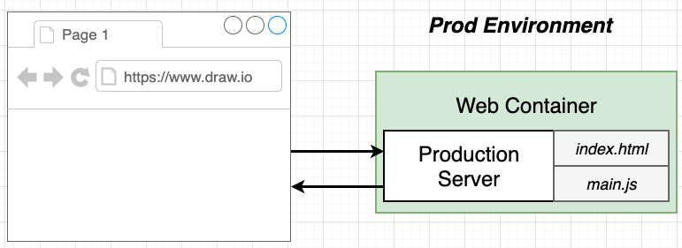
> for this project we will use Nginx which a production server:  
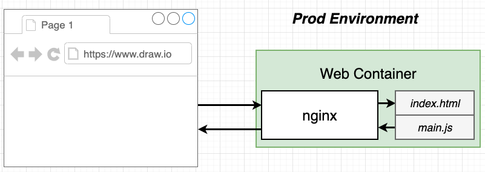

**remark**: for production purpose we don't need all the files, we only need the build file that will be created during the "npm run build" command  
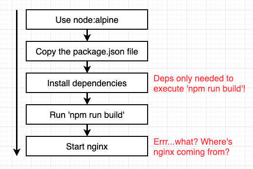
## building the production container - Multistep Builds
we will follow the steps below:   
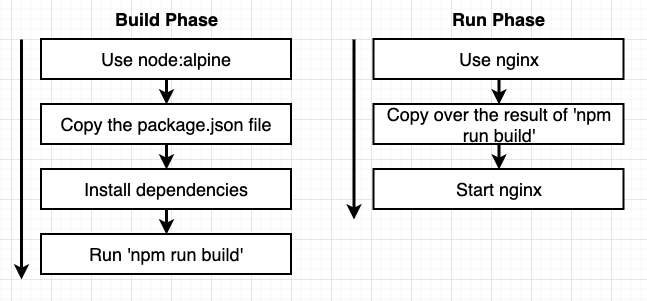  
so the dockerfile will be:  
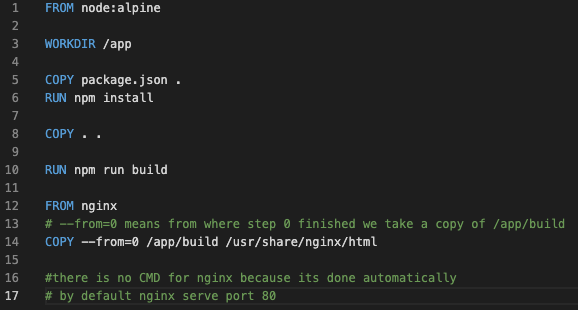  