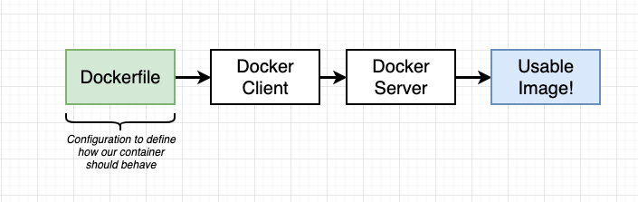
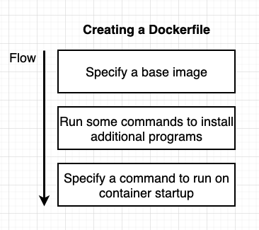
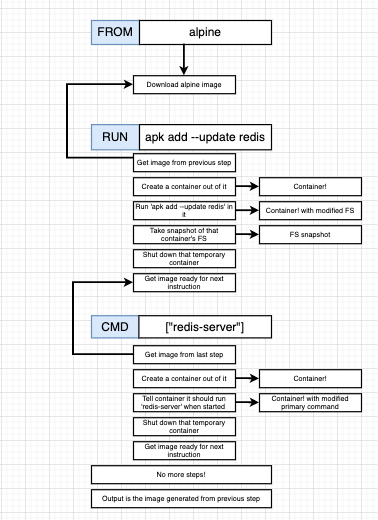
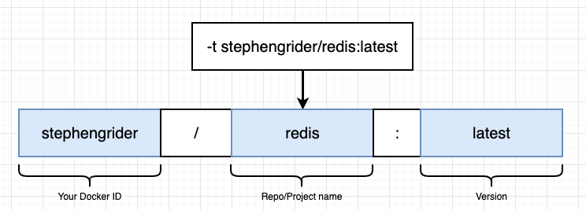

# Building docker Images

# Activity: create a docker image that runs redis-server

1) create a Dockerfile
dockerfile:  
"Use an existing docker image as a base"  
FROM alpine "this is the base image"  
 
"Download and install dependency"  
RUN apk add --update redis  "the command to be run"  

"tell the image what to do when it starts as a container"  
CMD ["redis-server"] "redis-server is the argument to CMD command"  

2) Build the image

> cd "file where the you have the dockerfile"
> docker build .

# creating Docker image analogy

# creating a docker image steps
building a docker image will use a temporary containers for each step  

> **Note** : the order is important for the build to use Cache

rebuilding the image using the same dockerfile will use cache until a step that has been changed following the original order  

# specifing a name (to be used instead of "container ID")

Docker build -t yourdockerID/Repo(projectname):version  

# creating manually a dcoker image with docker commit
1) create the base  
docker run -it Alpine sh 'this will open the shell using the alpine base'

2) Install dependencies inside the alpine shell
apk add --update redis

3) Open another terminal page
docker ps (and look for the running container) to get the container ID. 
docker commit -c 'CMD ["redis-server"]' CONTAINERID  
A new image ID will be created

docker run "image ID"

